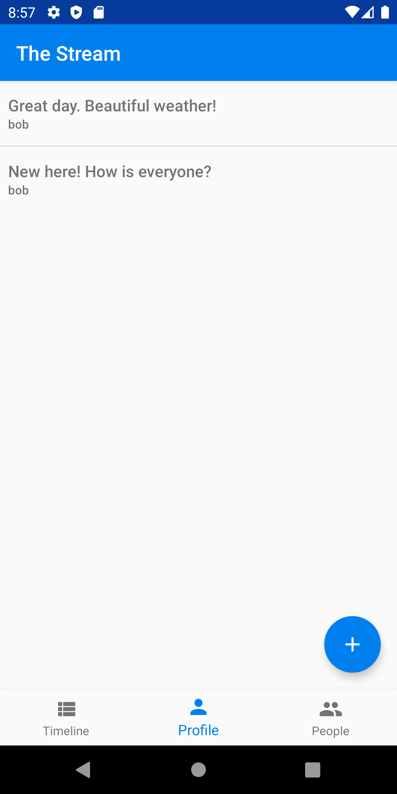
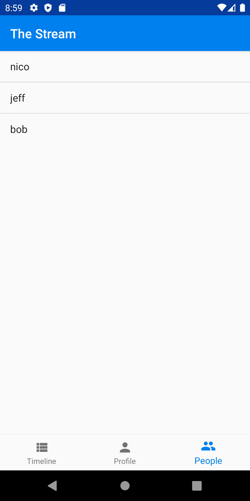
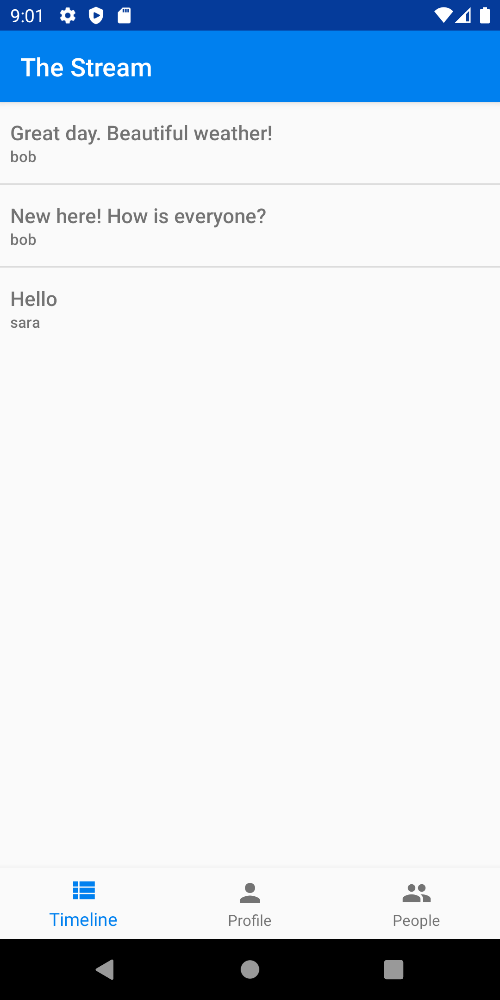

# Building a Custom Timeline with Stream Activity Feeds and Kotlin on Android

In this post, we'll be creating a simple social network, called The Stream, that allows a user to post messages to followers.

The app will allow a user to post a message to their followers. [Stream's Activity Feed API](https://getstream.io/activity-feeds/) combined with Android makes it straightforward to build this sort of complex interaction. All source code for this application is available on [GitHub](https://github.com/psylinse/stream-android-custom-timeline). This application is fully functional on Android.

Often there is context around those code snippets which are important, such as layout or navigation. Please refer to the full source if you're confused on how something works, what libraries and version are used, or how we got to a screen. Each snippet will be accompanied by a comment explaining which file and line it came from.

## Building The Stream

To build our social network we'll need both a backend and a mobile application. Most of the work is done in the mobile application, but we need the backend to securely create frontend tokens for interacting with the Stream API.

For the backend, we'll rely on [Express](https://expressjs.com/) ([Node.js](https://nodejs.org/en/)) leveraging [Stream Feed's JavaScript](https://github.com/GetStream/stream-js) library.

For the frontend, we'll build it with Kotlin wrapping [Stream Feed's Java](https://github.com/GetStream/stream-java) library. To post a message, the mobile application goes throught his flow:

* User types their name into our mobile application to log in.
* The Android app registers user with our backend and receives a Stream Activity Feed [frontend token](https://getstream.io/blog/integrating-with-stream-backend-frontend-options/).
* User types in their message and hits "Post". The mobile app uses the Stream token to create a Stream activity via Stream's REST API via the [Java library](https://github.com/GetStream/stream-java).
* User views their posts. The mobile app does this by retrieving its user feed via Stream.

If another user wants to follow a user and view their messages, the app goes through this process:

* Log in (see above).
* User navigates to the user list and selects a user to follow. The mobile app communicates with Stream API directly to create a [follower relationship](https://getstream.io/get_started/#follow) on their `timeline` feed.
* User views their timeline. The mobile app uses Stream API to retrieve their `timeline` feed, which is composed of all the messages from who they follow.

The code is split between the Android application contained in the `android` directory and the Express backend is in the `backend` directory. See the `README.md` in each folder to see installing and running instructions. If you'd like to follow along with running code, make sure you get both the backend and mobile app running before continuing.

## Prerequisites

Basic knowledge of Node.js (JavaScript) and Android (Kotlin) is required to follow this tutorial. This code is intended to run locally on your machine.

If you'd like to follow along, you'll need an account with [Stream](https://getstream.io/accounts/signup/). Please make sure you can [build a simple Android app](https://developer.android.com/training/basics/firstapp) before embarking on this tutorial. If you haven't done so, make sure you have [Android Studio](https://developer.android.com/studio/install) installed. 

Once you have an account with Stream, you need to set up a development app:


You'll need to add the credentials from the Stream app to the source code for it to work. See both the mobile and backend readmes.

Let's get to building!

## User Posts a Status Update

We'll start with a user posting a message.

### Step 1: Log In

In order to communicate with the Stream API, we need a secure frontend token that allows our mobile application to authenticate with Stream directly. This avoids having to proxy all calls through the backend (which is another way of building your application). To do this, we'll need a backend endpoint that uses our Stream account secrets to generate this token. Once we have this token, we don't need the backend to do anything else, since the mobile app has access to the Stream API limited by that user's permissions.

First, we'll be building the log in screen which looks like:


To start, let's lay our form out in Android. In our `activity_main.xml` layout we have a simple `ConstraintLayout` with an `EditText` and `Button`:

```xml
<!-- android/app/src/main/res/layout/activity_main.xml:1 -->
<?xml version="1.0" encoding="utf-8"?>
<androidx.constraintlayout.widget.ConstraintLayout xmlns:android="http://schemas.android.com/apk/res/android"
                                                   xmlns:app="http://schemas.android.com/apk/res-auto"
                                                   xmlns:tools="http://schemas.android.com/tools"
                                                   android:layout_width="match_parent"
                                                   android:layout_height="match_parent"
                                                   tools:context="io.getstream.thestream.MainActivity">

    <EditText
        android:id="@+id/user"
        android:layout_width="0dp"
        android:layout_height="wrap_content"
        android:layout_marginStart="16dp"
        android:layout_marginTop="16dp"
        android:autofillHints="Username"
        android:ems="10"
        android:hint="Username"
        android:inputType="textPersonName"
        app:layout_constraintEnd_toStartOf="@+id/submit"
        app:layout_constraintHorizontal_bias="0.5"
        app:layout_constraintStart_toStartOf="parent"
        app:layout_constraintTop_toTopOf="parent"
        tools:ignore="HardcodedText"/>

    <Button
        android:id="@+id/submit"
        android:layout_width="wrap_content"
        android:layout_height="wrap_content"
        android:layout_marginStart="16dp"
        android:layout_marginEnd="16dp"
        android:text="Login"
        app:layout_constraintBaseline_toBaselineOf="@+id/user"
        app:layout_constraintEnd_toEndOf="parent"
        app:layout_constraintHorizontal_bias="0.5"
        app:layout_constraintStart_toEndOf="@+id/user"
        tools:ignore="HardcodedText"/>

</androidx.constraintlayout.widget.ConstraintLayout>
```

Let's bind to this layout and respond in `MainActivity`:

```kotlin
// android/app/src/main/java/io/getstream/thestream/MainActivity.kt:16
class MainActivity : AppCompatActivity(), CoroutineScope by MainScope() {
    override fun onCreate(savedInstanceState: Bundle?) {
        super.onCreate(savedInstanceState)
        setContentView(R.layout.activity_main)

        val submit: Button = findViewById(R.id.submit)
        val userView: EditText = findViewById(R.id.user)

        submit.setOnClickListener {
            val user: String = userView.text.toString()

            launch(Dispatchers.IO) {
                BackendService.signIn(user)

                val feedCredentials = BackendService.getFeedCredentials()

                launch(Dispatchers.Main) {
                    FeedService.init(user, feedCredentials)

                    startActivity(
                        Intent(applicationContext, AuthedMainActivity::class.java)
                    )
                }
            }
        }
    }
}
```

*Note: The asyncronous approach in this tutorial is not necessarily the best or most robust approach. It's simply a straightforward way to show async interactions without cluttering the code too much. Please research and pick the best asynchronous solution for your application*


Here we bind to our button and user input. We listen to the submit button and sign into our backend. Since this work is making network calls, we need to do this asynchronously. We use Kotlin coroutines to accomplish this by binding to the [`MainScope`](https://kotlin.github.io/kotlinx.coroutines/kotlinx-coroutines-core/kotlinx.coroutines/-main-scope.html). We dispatch our sign in code which tells our `BackendService` to perform two tasks, sign in to backend and get the feed frontend credentials. We'll look at how the `BackendService` accomplishes this in a second. 

Once we have our tokens, we initialize our `FeedService` so we can talk to Stream's API (we'll see this in a second as well). When the user is fully authed and we have our credentials, we start a new activity called `AuthedMainActivity` which is the rest of the application.

Before seeing how we post a message, let's see how we auth and initialize the Stream Feed. First we sign in to the backend via `BackendService.signIn`:

```kotlin
// android/app/src/main/java/io/getstream/thestream/services/BackendService.kt:18
fun signIn(user: String) {
    authToken = post(
        "/v1/users",
        mapOf("user" to user)
    )
        .getString("authToken")
    this.user = user
}

// ...

private fun post(path: String, body: Map<String, Any>, authToken: String? = null): JSONObject {
    val request = Request.Builder()
        .url("$apiRoot${path}")
        .post(JSONObject(body).toString().toRequestBody(JSON))

    if (authToken != null) {
        request.addHeader("Authorization", "Bearer $authToken")
    }

    http.newCall(request.build()).execute().use {
        return JSONObject(it.body!!.string())
    }
}
```

We do a simple `POST` http request to our backend endpoint `/v1/users`, which returns a `backend` `authToken` that allows the mobile application to make further requests against the backend. Since this not a real implemenation of auth, we'll skip the backend code. Please refer to the source if you're curious. Also keep in mind, this token *is not* the Stream token. We need to make another call for that.

Once the user is signed in with our `backend` we can get our feed credentials via `BackendService.getFeedCredentials()`:

```kotlin
// android/app/src/main/java/io/getstream/thestream/services/BackendService.kt:27
data class StreamCredentials(val token: String, val apiKey: String)

fun getFeedCredentials(): StreamCredentials {
    val response = post(
        "/v1/stream-feed-credentials",
        mapOf(),
        authToken
    )

    return StreamCredentials(
        response.getString("token"),
        response.getString("apiKey")
    )
}
```

Similar to before, we `POST` to our `backend` to get our feed credentials. The one difference being we use our `authToken` to authenticate against our backend. Since this backend endpoint creates a Stream user for us, let's take a look:

```javascript
// backend/src/controllers/v1/stream-feed-credentials/stream-feed-credentials.action.js:1
import dotenv from 'dotenv';
import stream from "getstream";

dotenv.config();

exports.streamFeedCredentials = async (req, res) => {
  try {
    const apiKey = process.env.STREAM_API_KEY;
    const apiSecret = process.env.STREAM_API_SECRET;
    const appId = process.env.STREAM_APP_ID;

    const client = stream.connect(apiKey, apiSecret, appId);

    await client.user(req.user).getOrCreate({ name: req.user });
    const token = client.createUserToken(req.user);

    res.status(200).json({ token, apiKey, appId });
  } catch (error) {
    console.log(error);
    res.status(500).json({ error: error.message });
  }
};
```

We use the [Stream JavaScript library](https://github.com/GetStream/stream-js) to create a user (if they don't exist) and generate a [Stream frontend token](https://getstream.io/blog/integrating-with-stream-backend-frontend-options/). We return this token, alongside some api information, back to the Android app.

In the mobile app, we use the returned credentials to intialize our `FeedService` by calling `FeedService.init` in `MainActivity`. Here's the `init`:

```kotlin
// android/app/src/main/java/io/getstream/thestream/services/FeedService.kt:8
object FeedService {
    private lateinit var client: CloudClient
    private lateinit var user: String

    fun init(user: String, credentials: BackendService.StreamCredentials) {
        this.user = user
        client = CloudClient
            .builder(credentials.apiKey, credentials.token, user)
            .build()
    }

    // ...
}
```

The `FeedService` is a singleton (by using Kotlin's [object](https://kotlinlang.org/docs/reference/object-declarations.html)) which stores a `CloudClient` instance. `CloudClient` is a class provided by Stream's Java library. This class is specifically used to provide functionality to client applications via frontend tokens. Stream's Java library contains a normal client for backend applications, so don't get confused on which client to use. The normal client requires private credentials which you don't want to embed in your mobile application!

Now that we're authenticated with Stream, we're ready to post our first message!

### Step 2: Posting a Message

Now we'll build the form to post a status message to our Stream activity feed. We won't dive into navigation and layout in this tutorial. Please refer to the [source](https://github.com/psylinse/stream-android-custom-timeline) if you're curious about how we get to this screen or skip ahead to Step 3. We'll need to build a form that takes what the user wants to say to their followers and submit that to Stream. We use an activity called `CreatePostActivity` to handle new posts:

```kotlin
// android/app/src/main/java/io/getstream/thestream/CreatePostActivity.kt:13
const val POST_SUCCESS = 99

class CreatePostActivity : AppCompatActivity(), CoroutineScope by MainScope() {

    override fun onCreate(savedInstanceState: Bundle?) {
        super.onCreate(savedInstanceState)
        setContentView(R.layout.activity_create_post)

        val submit: Button = findViewById(R.id.submit)
        val postView: EditText = findViewById(R.id.post_text)

        submit.setOnClickListener {
            val text: String = postView.text.toString()

            launch(Dispatchers.IO) {
                FeedService.post(text)

                launch(Dispatchers.Main) {
                    setResult(POST_SUCCESS)
                    finish()
                }
            }
        }
    }
}
```

With the layout:

```xml
<!-- android/app/src/main/res/layout/activity_create_post.xml:1 -->
<?xml version="1.0" encoding="utf-8"?>

<androidx.constraintlayout.widget.ConstraintLayout xmlns:android="http://schemas.android.com/apk/res/android"
                                                   xmlns:app="http://schemas.android.com/apk/res-auto"
                                                   xmlns:tools="http://schemas.android.com/tools"
                                                   android:layout_width="match_parent"
                                                   android:layout_height="match_parent"
                                                   tools:context="io.getstream.thestream.MainActivity">

    <EditText
        android:id="@+id/post_text"
        android:layout_width="0dp"
        android:layout_height="wrap_content"
        android:layout_marginStart="16dp"
        android:layout_marginTop="16dp"
        android:autofillHints="Enter Post..."
        android:ems="10"
        android:hint="Post Text"
        android:inputType="text"
        app:layout_constraintEnd_toStartOf="@+id/submit"
        app:layout_constraintHorizontal_bias="0.5"
        app:layout_constraintStart_toStartOf="parent"
        app:layout_constraintTop_toTopOf="parent"/>

    <Button
        android:id="@+id/submit"
        android:layout_width="wrap_content"
        android:layout_height="wrap_content"
        android:layout_marginStart="16dp"
        android:layout_marginEnd="16dp"
        android:text="Post"
        app:layout_constraintBaseline_toBaselineOf="@+id/post_text"
        app:layout_constraintEnd_toEndOf="parent"
        app:layout_constraintHorizontal_bias="0.5"
        app:layout_constraintStart_toEndOf="@+id/post_text"/>

</androidx.constraintlayout.widget.ConstraintLayout>
```

This simple layout is identical to our log in widget. When bind to our submit and take the `EditText` text value and send that to `FeedService.post`. When compoleted, we set a success result and finish the activity. Let's look at `FeedService.post`:

```kotlin
// android/app/src/main/java/io/getstream/thestream/services/FeedService.kt:40
fun post(message: String) {
    val feed = client.flatFeed("user")
    feed.addActivity(
        Activity
            .builder()
            .actor("SU:${user}")
            .verb("post")
            .`object`(UUID.randomUUID().toString())
            .extraField("message", message)
            .build()
    ).join()
}
```

Here we use Stream Java's `CloudClient` from the [Cloud package](https://getstream.github.io/stream-java/io/getstream/cloud/package-summary.html). This set of classes take our frontend token which allows the mobile app to communicate directly with Stream. We are authenticated only to post activities for the actor SU:john (SU means Stream User). Since we aren't storing a corresponding object in a database, we generate an id to keep each post unique. We also pass along a message payload which is what our followers will see.

You may be wondering what the `client.flatFeed("user")` is referring to. In order for this to work, we need to set up a flat feed called "user" in Stream. This is where every user's feed, which only contains their messages will be stored. Later we'll see how one user can follow another user's feed.

Inside of your Stream development app create a flat feed called "user":


That's all we need for Stream to store our messages. Once all of functions return we return to the user's profile screen which will display our posted messages. We'll build this next.

### Step 3: Displaying Messages on our Profile

Let's first build a fragment that will contain the user's messages. Here is what the screen will look like:



And here is the code for the `ProfileFragment`:

```kotlin
class ProfileFragment : Fragment(), CoroutineScope by MainScope() {
    private lateinit var adapter: FeedAdapter

    override fun onCreateView(
        inflater: LayoutInflater,
        container: ViewGroup?,
        savedInstanceState: Bundle?
    ): View? {
        val rootView: View = inflater.inflate(R.layout.fragment_profile, container, false)
        val listView: ListView = rootView.findViewById(R.id.list_profile_feed)

        adapter = FeedAdapter(rootView.context, mutableListOf())
        listView.adapter = adapter

        val newPost: View = rootView.findViewById(R.id.new_post)
        newPost.setOnClickListener {
            startActivityForResult(
                Intent(rootView.context, CreatePostActivity::class.java),
                POST_SUCCESS
            )
        }

        loadProfileFeed()

        return rootView
    }

    override fun onActivityResult(requestCode: Int, resultCode: Int, data: Intent?) {
        super.onActivityResult(requestCode, resultCode, data)

        if (resultCode == POST_SUCCESS) {
            loadProfileFeed()
        }
    }

    private fun loadProfileFeed() {
        launch(Dispatchers.IO) {
            val profileFeed = FeedService.profileFeed()

            launch(Dispatchers.Main) {
                adapter.clear()
                adapter.addAll(profileFeed)
            }
        }
    }
}
```

And the layout:

```xml
<!-- android/app/src/main/res/layout/fragment_profile.xml -->
<?xml version="1.0" encoding="utf-8"?>
<FrameLayout xmlns:android="http://schemas.android.com/apk/res/android"
             xmlns:tools="http://schemas.android.com/tools"
             android:layout_width="match_parent"
             android:layout_height="match_parent"
             tools:context=".ProfileFragment">

    <com.google.android.material.floatingactionbutton.FloatingActionButton
        android:id="@+id/new_post"
        android:layout_width="wrap_content"
        android:layout_height="wrap_content"
        android:layout_gravity="end|bottom"
        android:layout_margin="16dp"
        android:src="@drawable/ic_add_white_24dp"/>

    <ListView
        android:id="@+id/list_profile_feed"
        android:layout_width="match_parent"
        android:layout_height="wrap_content"/>

</FrameLayout>
```

The `ProfileFragment` does two things. First, it has a floating action button which starts our `CreatePostActivity`, which we saw in Step 2, and handles the result. Second, it loads our personal feed and displays those messages.

Let's see how we load our messages via `FeedService.profileFeed()` invoked inside of `loadProfileFeed`:

```kotlin
// android/app/src/main/java/io/getstream/thestream/services/FeedService.kt:33
fun profileFeed(): MutableList<Activity> {
    return client
        .flatFeed("user")
        .getActivities(Limit(25))
        .join()
}
```

Using this result, we pass the activities into a `FeedAdapter` which backs a simple `ListAdapter`. Here you can see how to use the raw results from Stream however you want. In this case we'll simply display the activity's message and author:

```kotlin
// android/app/src/main/java/io/getstream/thestream/FeedAdapter.kt:13
class FeedAdapter(context: Context, objects: MutableList<Activity>) :
    ArrayAdapter<Activity>(context, android.R.layout.simple_list_item_1, objects) {

    private data class ViewHolder(
        val author: TextView,
        val message: TextView
    )

    override fun getView(position: Int, convertView: View?, parent: ViewGroup): View {
        val streamActivity: Activity = getItem(position)!!
        val viewHolder: ViewHolder
        var newView = convertView

        if (newView == null) {
            val inflater = LayoutInflater.from(context)
            newView = inflater.inflate(R.layout.feed_item, parent, false)
            viewHolder = ViewHolder(
                newView.timeline_item_author_name as TextView,
                newView.timeline_item_message as TextView
            )
        } else {
            viewHolder = newView.tag as ViewHolder
        }

        viewHolder.author.text = streamActivity.actor.replace("SU:", "")
        viewHolder.message.text = streamActivity.extra["message"] as String

        newView!!.tag = viewHolder

        return newView
    }
}
```

To keep thing simple, we use a simple list layout, with a custom view (`feed_item`, please see source) that shows the message and author. However, you can build any view you want! Here, the message is in extras to show you how to include arbitrary data in your activities. Extras is a container that allows you to include any data you want.

Next we'll see how to follow multiple user's via a timeline feed.

## User Timeline

Now that users can post messages, we'd like to follow a few and see a combined feed of all the messages for users we follow.

### Step 1: Follow a User

The first thing we need to do is view a list of users and pick a few to follow. We'll start by creating a view that shows all the users and lets a user follow a few. Here is the screen that shows all the users:



This is backed by a `PeopleFragment`:

```kotlin
// android/app/src/main/java/io/getstream/thestream/PeopleFragment.kt:21
class PeopleFragment : Fragment(), CoroutineScope by MainScope() {

    override fun onCreateView(
        inflater: LayoutInflater,
        container: ViewGroup?,
        savedInstanceState: Bundle?
    ): View? {
        val rootView: View = inflater.inflate(R.layout.fragment_people, container, false)
        val list: ListView = rootView.findViewById(R.id.list_people)

        val adapter = ArrayAdapter(
            rootView.context,
            android.R.layout.simple_list_item_1,
            mutableListOf<String>()
        )
        list.adapter = adapter

        list.onItemClickListener = AdapterView.OnItemClickListener { _, _, position, _ ->
            val alertDialogBuilder: AlertDialog.Builder = AlertDialog.Builder(rootView.context)

            alertDialogBuilder.setTitle("Pick an action")
            alertDialogBuilder.setPositiveButton("Follow") { dialog, _ ->
                val otherUser = adapter.getItem(position).toString()
                FeedService.follow(otherUser)

                dialog.dismiss()

                Toast
                    .makeText(context, "Successfully followed $otherUser", Toast.LENGTH_LONG)
                    .show()
            }

            alertDialogBuilder.setNegativeButton("Close") { dialog, _ ->
                dialog.dismiss()
            }

            alertDialogBuilder.show()
        }

        launch(Dispatchers.IO) {
            val users = BackendService.getUsers()

            launch(Dispatchers.Main) { adapter.addAll(users) }
        }

        return rootView
    }

}
```

And the layout:

```xml
<!-- android/app/src/main/res/layout/fragment_people.xml:1 -->
<?xml version="1.0" encoding="utf-8"?>

<FrameLayout xmlns:android="http://schemas.android.com/apk/res/android"
             xmlns:tools="http://schemas.android.com/tools"
             android:layout_width="match_parent"
             android:layout_height="match_parent"
             tools:context=".PeopleFragment">

    <ListView
        android:id="@+id/list_people"
        android:layout_width="match_parent"
        android:layout_height="wrap_content"/>

</FrameLayout>
```

The `PeopleFragment` is a simple list view that displays our people. To populate the users on load, we use `BackendService.getUsers()` which is a simple `GET` request against our backend:

```kotlin
// android/app/src/main/java/io/getstream/thestream/services/BackendService.kt:42
fun getUsers(): List<String> {
    val request = Request.Builder()
        .url("$apiRoot/v1/users")
        .addHeader("Authorization", "Bearer $authToken")
        .get()

    http.newCall(request.build()).execute().use { response ->
        val jsonArray = JSONObject(response.body!!.string()).getJSONArray("users")

        return List(jsonArray.length()) { i ->
            jsonArray.get(i).toString()
        }.filterNot { it == user }
    }
}
```

The `backend` is a mock implementation that simple stores the users in an object. We won't go into this here, but refer to source if interesting and be sure to back this with a real implementation. 

Once we have our users we build our list and bind a click listener. This listener will pop open an alert dialog that allows us to follow a user. If a user chooses to follow a user we call `FeedService.follow`:

```kotlin
// android/app/src/main/java/io/getstream/thestream/services/FeedService.kt:19
fun follow(otherUser: String) {
    client
        .flatFeed("timeline")
        .follow(client.flatFeed("user", otherUser))
        .join()
}
```

Here we're adding a [follow relationship](https://getstream.io/docs/#following) to another user's `user` feed to this user's `timeline` feed. All this means is anytime a user posts to their user feed (implemented in the first part) we'll see it on our `timeline` feed. The cool part is, we can add any number of users feeds to our `timeline` feed and Stream will return a well-ordered list of activities.

Since we have a new feed type, we need to set this up in Stream. Just like the `user` feed, navigate to the Stream app you set up and create a flat feed group called timeline:


## Step 2: View Timeline

Now that we have a way to follow users we can view our timeline. When we're done, assuming we've followed "bob" and "sara" we'll see a screen that looks like this:



Let's look at the code to display our timeline. We have a `TimelineFragment`:

```kotlin
// android/app/src/main/java/io/getstream/thestream/TimelineFragment.kt:16
class TimelineFragment : Fragment(), CoroutineScope by MainScope() {
    override fun onCreateView(
        inflater: LayoutInflater,
        container: ViewGroup?,
        savedInstanceState: Bundle?
    ): View? {
        val rootView: View = inflater.inflate(R.layout.fragment_timeline, container, false)
        val listView: ListView = rootView.findViewById<View>(R.id.list_timeline) as ListView
        val adapter = FeedAdapter(context!!, mutableListOf())

        listView.adapter = adapter

        launch(Dispatchers.IO) {
            val timelineFeed = FeedService.timelineFeed()
            launch(Dispatchers.Main) { adapter.addAll(timelineFeed) }
        }

        return rootView
    }
}
```

And our layout:

```xml
<!-- android/app/src/main/res/layout/fragment_timeline.xml:1 -->
<?xml version="1.0" encoding="utf-8"?>
<FrameLayout xmlns:android="http://schemas.android.com/apk/res/android"
             xmlns:tools="http://schemas.android.com/tools"
             android:layout_width="match_parent"
             android:layout_height="match_parent"
             tools:context=".TimelineFragment">

    <ListView
        android:id="@+id/list_timeline"
        android:layout_width="wrap_content"
        android:layout_height="wrap_content"/>

</FrameLayout>
```

Since we already built our `FeedAdapter`, we simply need to get the activities for `timeline` via `FeedService.timelineFeeed`:

```kotlin
// android/app/src/main/java/io/getstream/thestream/services/FeedService.kt:26
fun timelineFeed(): MutableList<Activity> {
    return client
        .flatFeed("timeline")
        .getActivities(Limit(25))
        .join()
}
```

This code is the same as getting our profile, except we ask for our `timeline` feed instead. And that's it! We now have a fully functioning mini social network.